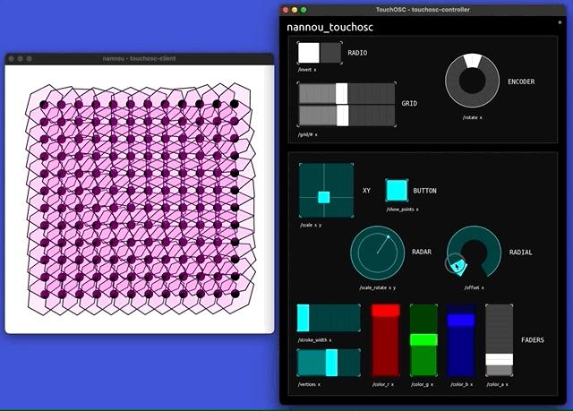

# nannou_touchosc

`nannou_touchosc`is a library for receiving OSC messages from TouchOSC controllers in Nannou.



## Overview

**<a href="https://hexler.net/touchosc" target="_blank">TouchOSC</a>** is a cross-platform controller used extensively by artists.
It provides an editor for quickly designing and publishing custom  interfaces that can control other devices and applications using OSC. TouchOSC is available for Windows, MacOS, Linux, iOS, Android and some other unique environments. 

**<a href="https://nannou.cc/" target="_blank">Nannou</a>** is a creative coding framework written in [Rust](https://www.rust-lang.org/). Nannou aims to make it easy for artists to express themselves with simple, fast, reliable code. 

**[nannou_touchosc](#)** is a Nannou library that makes it easy for artists and designers to quickly create custom interfaces and send values via OSC. 

### Dependencies

This library uses `nannou`, `nannou_OSC` and `regex` crates. The library was tested using TouchOSC `v1.1.3`. Note that `nannou_touchosc` is *not* intended for `mk1`.

*this `Cargo.toml`*
```
[dependencies]
nannou = "0.18.0"
nannou_osc = "0.18.0"
regex = "1.5.6"
```

# Getting Started

### 1. Add `nannou_touchosc` to your Cargo Workspace

*inside `Cargo.toml` of your workspace directory:*

```
[workspace]

members = [
    "your_nannou_sketchbook"
    "nannou_touchosc",
    "...etc"
]
```

### 2. Import the TouchOSC Library

*included at the top of the sketch*

```
use nannou_touchosc::TouchOscClient;
```

### 3. Create a New TouchOSC Client

*provide which OSC port to listen on*

```
let mut touchosc = TouchOscClient::new(6555);
```

### 4. Add TouchOSC Inputs

*provide a unique address, as well as min, max and default values*
```
touchosc.add_fader("/my-fader", 0.0, 1.0, 0.5);
```

### 5. Update TouchOSC Input Values

*check for new OSCmessages and update the client*
```
touchosc.update();
```

### 6. Read TouchOSC Input Values

*read values using the previously assigned address*
```
let fader_value = touchosc.fader("/my-fader");

println!("My fader value = {}", fader_value);
```

# Documentation

`TODO`